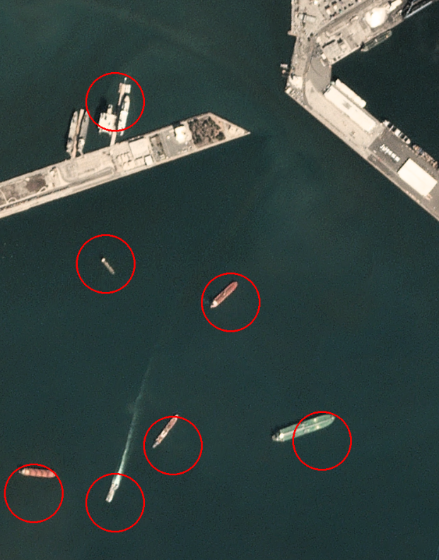

# Satellite Image Ship Classification ML Pipeline

This project implements a ***machine learning satellite image classification pipeline*** for counting and locating container ships in open waters. The app is implemented using ***FAST API*** which rececives a satellite image and its resolution from the client, and returns the count and positions the ships relative to the image. 

The classification is done by first tiling the image into chuncks and using a ***convolutional neural network*** to classify the overlapping batches as either 1 or 0 for containing a ship or not, respectively. To avoid repeated observations the model outputs are clustered using ***DBSCAN*** and the cluster centroids are reported as the ships position. The CNN architecture consist of repeated Convolutional and MaxPool layers with a 98% accuracy on the training set. With real landscape satellite imagery the model has a ***recall score of 90%*** with signs a few signs of false positive results related to narrow docks.

The dataset used for training and testing are from Planet's openly licensed Open California dataset, which contains satellite images from the San Francisco Bay area. Available to download [here](https://www.kaggle.com/datasets/rhammell/ships-in-satellite-imagery).



### Pipeline structure:

**1. API Request:** 

- A user sends an HTTP POST request to */api/v1/analyze/json* with a .png file payload.

**2. Routing:**

- Server gets the request.

- The app sees the URL and matches it to the router from endpoints.py.

**3. Endpoint Logic:**

- FastAPI, using the UploadFile type, handles the file upload.

- If validation passes, the file's bytes are read and passed to predictor.predict(...).

- Preprocessing resizes the image to match 3.0 m/pixel resolution, normalizes pixel values, and constructs a grid of overlapping tiles.

- The CNNShipClassifier proudces a prediction for each tile and a prediction confidence.

- DBSCAN is used to cluster the predictions.

- The function returns a PredictionResponse object. FastAPI automatically converts this Pydantic object into a clean JSON string containing the results and sends it back to the user with a 200 OK status. Alternatively the */analyze/image* endpoint is called and the original image is returned with marked predictions.

- The user receives the ship count in the image as well as positions of the identified ships.


### Installation and Setup:

1. **Install dependencies using uv:**
   ```bash
   uv sync
   ```

### Run and test with uvicorn:

1. **Start the FastAPI server:**
   ```bash
   uv run uvicorn app.main:app --reload
   ```

2. **Access the interactive API documentation:**
   - Open your browser and go to: http://127.0.0.1:8000/docs to try the API out.

